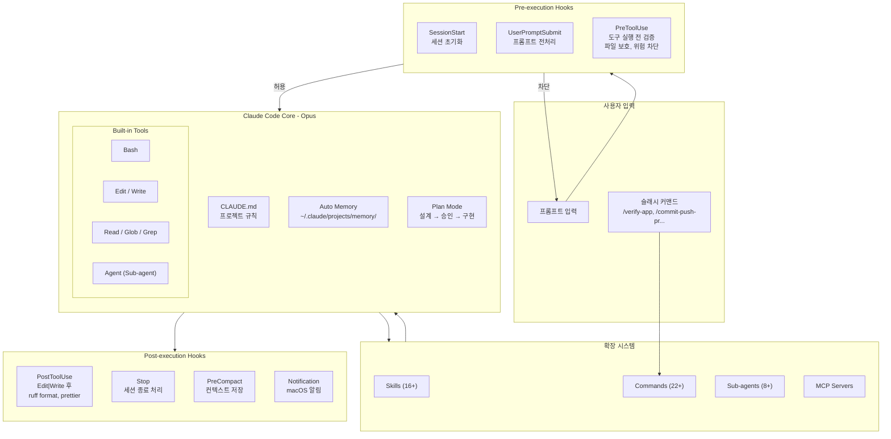
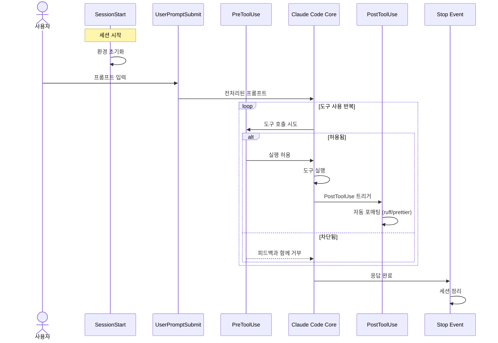

# Claude Code 통합 아키텍처

AOS 프로젝트에서 Claude Code가 어떻게 통합되어 있는지에 대한 아키텍처 문서.

---

## 시스템 개요



## 이벤트 라이프사이클



---

## 구성 요소 상세

### Skills (스킬)

자동 발견 기반의 도메인 지식 시스템. 사용자가 명시적으로 호출하지 않아도 컨텍스트에 맞게 로드됨.

| 카테고리 | 스킬 | 설명 |
|---------|------|------|
| **개발** | `react-web-development` | React/TS/Tailwind/Zustand |
| **개발** | `test-automation` | Vitest 테스트 생성 |
| **품질** | `verification-loop` | Boris Cherny 검증 루프 |
| **품질** | `ace-framework` | ACE 거버넌스 |
| **메타** | `skill-creator` | 스킬 생성 |
| **메타** | `hook-creator` | 훅 생성 |
| **메타** | `subagent-creator` | 에이전트 생성 |
| **메타** | `slash-command-creator` | 커맨드 생성 |
| **운영** | `parallel-coordinator` | 병렬 실행 조율 |
| **운영** | `cli-orchestration` | CLI 오케스트레이션 |
| **관측** | `agent-observability` | 에이전트 추적 |
| **관측** | `agent-improvement` | 에이전트 개선 |

**스킬 구조**:
```
.claude/skills/[skill-name]/
├── SKILL.md          # 메인 정의 (frontmatter + 내용)
├── references/       # 참조 문서
└── assets/           # 템플릿, 스크립트
```

### Commands (슬래시 커맨드)

사용자가 `/command` 형태로 명시적으로 호출하는 워크플로우 자동화.

| 카테고리 | 커맨드 | 설명 |
|---------|--------|------|
| **개발** | `/commit-push-pr` | Git 워크플로우 자동화 |
| **개발** | `/deploy-with-tests` | 테스트 후 배포 |
| **개발** | `/draft-commits` | 커밋 초안 생성 |
| **품질** | `/verify-app` | 종합 검증 (tsc+ruff+pytest+build) |
| **품질** | `/check-health` | 프로젝트 건강 검진 |
| **품질** | `/test-coverage` | 테스트 커버리지 분석 |
| **품질** | `/review` | 코드 리뷰 |
| **운영** | `/dev-docs` | Dev Docs 3-파일 시스템 |
| **운영** | `/save-and-compact` | 컨텍스트 저장 + 압축 |
| **운영** | `/resume` | 이전 세션 복원 |
| **운영** | `/sync-registry` | 레지스트리 동기화 |
| **평가** | `/run-eval` | 에이전트 평가 실행 |

### Sub-agents (서브에이전트)

특화된 작업을 위한 독립 AI 어시스턴트.

| 에이전트 | 모델 | 역할 |
|---------|------|------|
| `aos-orchestrator` | opus | 멀티에이전트 조율 |
| `web-ui-specialist` | inherit | React/Tailwind UI |
| `backend-integration-specialist` | inherit | FastAPI/LangGraph |
| `test-automation-specialist` | haiku | 테스트 자동화 |
| `performance-optimizer` | haiku | 성능 최적화 |
| `quality-validator` | haiku | 품질 검증 |
| `eval-task-runner` | inherit | 평가 태스크 실행 |
| `eval-grader` | inherit | 평가 채점 |

**에이전트 파일 위치**: `.claude/agents/`
**공유 프로토콜**: `.claude/agents/shared/quality-reference.md`

### MCP Servers

Model Context Protocol을 통한 외부 도구 연동.

| 서버 | 용도 |
|------|------|
| `filesystem` | 파일 시스템 접근 |
| `github` | GitHub API (PR, Issue) |
| `playwright` | 브라우저 자동화, E2E 테스트 |

---

## Hook 이벤트 구조

```
┌─────────────────────────────────────────────────┐
│ SessionStart → 세션 초기화                        │
│                                                  │
│ UserPromptSubmit → 프롬프트 전처리                │
│                                                  │
│ ┌─ Loop: 도구 사용 ──────────────────────────┐   │
│ │                                            │   │
│ │  PreToolUse → 검증/차단                     │   │
│ │       ↓                                    │   │
│ │  [도구 실행]                                │   │
│ │       ↓                                    │   │
│ │  PostToolUse → 포매팅/로깅                  │   │
│ │  (PostToolUseFailure → 에러 시)             │   │
│ │                                            │   │
│ │  PermissionRequest → 권한 자동 처리          │   │
│ │                                            │   │
│ └────────────────────────────────────────────┘   │
│                                                  │
│ SubagentStart / SubagentStop → 에이전트 관리      │
│                                                  │
│ Notification → 알림                               │
│                                                  │
│ PreCompact → 컨텍스트 저장                        │
│                                                  │
│ Stop → 응답 완료 처리                             │
│                                                  │
│ SessionEnd → 세션 종료 정리                       │
└─────────────────────────────────────────────────┘
```

---

## LLM 연동

AOS는 자체 LLM Router를 통해 여러 프로바이더를 직접 연동합니다:

```
Claude Code (Opus) ─── Claude Code 자체 LLM
        │
AOS Backend ──┬── Google Gemini (기본)
              ├── Anthropic Claude
              └── Ollama (로컬)
```

**설정**: `.env` 파일의 `LLM_PROVIDER` 환경변수로 프로바이더 선택.

---

## 수치 요약

| 구성요소 | 수량 | 위치 |
|---------|------|------|
| **Hook Events** | 13 | `settings.json` |
| **Skills** | 16+ | `.claude/skills/` |
| **Commands** | 22+ | `.claude/commands/` |
| **Sub-agents** | 8+ | `.claude/agents/` |
| **MCP Servers** | 3 | `.claude/settings.json` |
| **Shared Protocols** | 1 | `.claude/agents/shared/` |

---

## 관련 문서

- `CLAUDE.md` - 프로젝트 메인 가이드
- `docs/architecture.md` - AOS 시스템 아키텍처
- `.claude/skills/hook-creator/` - 훅 생성 스킬
- `.claude/skills/subagent-creator/` - 에이전트 생성 스킬
- `.claude/skills/slash-command-creator/` - 커맨드 생성 스킬
- `docs/guides/boris-cherny-workflow-guide.md` - Boris Cherny 워크플로우
