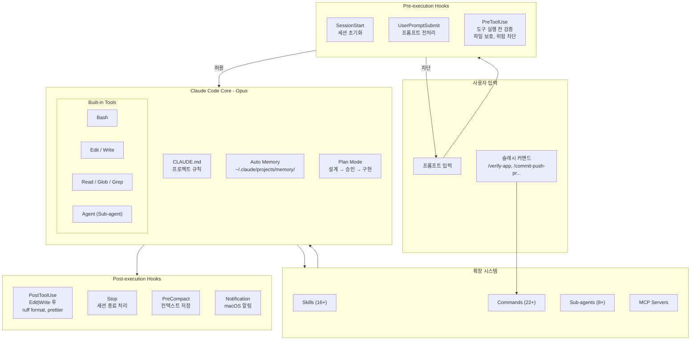
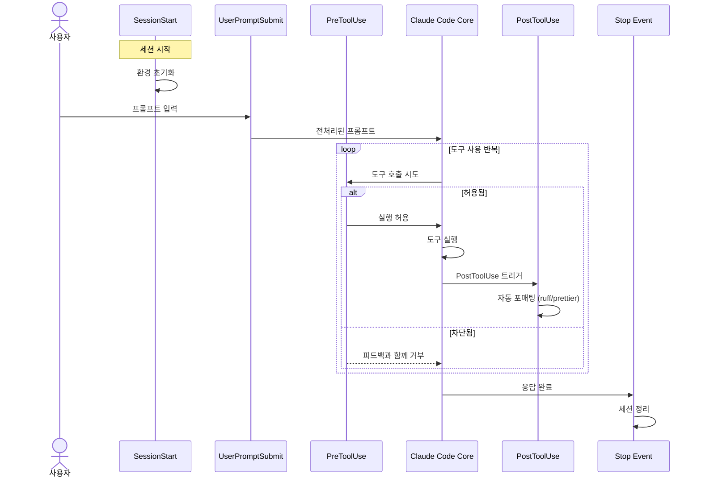

# Claude Code 통합 아키텍처

AOS 프로젝트에서 Claude Code가 어떻게 통합되어 있는지에 대한 아키텍처 문서.

---

## 시스템 개요


```mermaid
flowchart TB
    subgraph USER["사용자 입력"]
        prompt["프롬프트 입력"]
        slash["슬래시 커맨드<br/>/verify-app, /commit-push-pr..."]
    end

    subgraph HOOKS_PRE["Pre-execution Hooks"]
        direction TB
        sessionStart["SessionStart<br/>세션 초기화"]
        userPromptSubmit["UserPromptSubmit<br/>프롬프트 전처리"]
        preToolUse["PreToolUse<br/>도구 실행 전 검증<br/>파일 보호, 위험 차단"]
    end

    subgraph CORE["Claude Code Core - Opus"]
        direction TB
        claudeMD["CLAUDE.md<br/>프로젝트 규칙"]
        memory["Auto Memory<br/>~/.claude/projects/memory/"]
        planMode["Plan Mode<br/>설계 → 승인 → 구현"]

        subgraph TOOLS["Built-in Tools"]
            bash["Bash"]
            edit["Edit / Write"]
            read["Read / Glob / Grep"]
            agent["Agent (Sub-agent)"]
        end
    end

    subgraph HOOKS_POST["Post-execution Hooks"]
        direction TB
        postToolUse["PostToolUse<br/>Edit|Write 후<br/>ruff format, prettier"]
        stop["Stop<br/>세션 종료 처리"]
        preCompact["PreCompact<br/>컨텍스트 저장"]
        notification["Notification<br/>macOS 알림"]
    end

    subgraph EXTENSIONS["확장 시스템"]
        direction TB
        skills["Skills (16+)"]
        commands["Commands (22+)"]
        agents["Sub-agents (8+)"]
        mcp["MCP Servers"]
    end

    prompt --> HOOKS_PRE
    slash --> commands
    HOOKS_PRE -->|"허용"| CORE
    HOOKS_PRE -->|"차단"| prompt
    CORE --> HOOKS_POST
    CORE --> EXTENSIONS
    EXTENSIONS --> CORE
```

## 이벤트 라이프사이클


```mermaid
sequenceDiagram
    actor User as 사용자
    participant SS as SessionStart
    participant UPS as UserPromptSubmit
    participant PTU as PreToolUse
    participant CC as Claude Code Core
    participant POTU as PostToolUse
    participant Stop as Stop Event

    Note over SS: 세션 시작
    SS->>SS: 환경 초기화

    User->>UPS: 프롬프트 입력
    UPS->>CC: 전처리된 프롬프트

    loop 도구 사용 반복
        CC->>PTU: 도구 호출 시도
        alt 허용됨
            PTU->>CC: 실행 허용
            CC->>CC: 도구 실행
            CC->>POTU: PostToolUse 트리거
            POTU->>POTU: 자동 포매팅 (ruff/prettier)
        else 차단됨
            PTU-->>CC: 피드백과 함께 거부
        end
    end

    CC->>Stop: 응답 완료
    Stop->>Stop: 세션 정리
```

---

## 구성 요소 상세

### Skills (스킬)

자동 발견 기반의 도메인 지식 시스템. 사용자가 명시적으로 호출하지 않아도 컨텍스트에 맞게 로드됨.

| 카테고리 | 스킬 | 설명 |
|---------|------|------|
| **개발** | `react-web-development` | React/TS/Tailwind/Zustand 개발 가이드 |
| **개발** | `test-automation` | Vitest/RTL 테스트 생성 및 커버리지 개선 |
| **품질** | `verification-loop` | 풀스택 검증 피드백 루프 (게이트 명령 SSOT) |
| **품질** | `verify-backend` | FastAPI/LangGraph/SQLAlchemy 패턴 검증 |
| **품질** | `verify-frontend` | React/TS/Tailwind 패턴 검증 (memo/displayName 등) |
| **운영** | `aos-feature-harness` | 풀스택 기능 개발 오케스트레이터 (계획→빌드→검증→리뷰→문서) |
| **운영** | `merge-worktree` | worktree 브랜치 squash-merge |
| **운영** | `update-llm-models` | LLM 모델 레지스트리 갱신 절차 |
| **관측** | `agent-observability` | 에이전트 트레이싱/메트릭 수집 |
| **관측** | `agent-improvement` | 에이전트 실패 진단 및 개선 |
| **평가** | `run-eval` | 에이전트 성능 벤치마크 실행 (pass@k 지표) |

**스킬 구조**:
```
.claude/skills/[skill-name]/
├── SKILL.md          # 메인 정의 (frontmatter + 내용)
├── references/       # 참조 문서
└── assets/           # 템플릿, 스크립트
```

### Commands (슬래시 커맨드)

사용자가 `/command` 형태로 명시적으로 호출하는 워크플로우 자동화.

| 카테고리 | 커맨드 | 설명 |
|---------|--------|------|
| **개발** | `/plan` | planner 에이전트로 구현 계획 수립 |
| **개발** | `/tdd` | tdd-guide 에이전트로 TDD 워크플로우 진행 |
| **개발** | `/explore` | 코드베이스 탐색으로 구조 파악 (`--deps` 의존성 추적) |
| **개발** | `/execute-tasks-file` | `dev/active/<phase>/*-tasks.md` 웨이브 순차 + 태스크 병렬 실행 |
| **개발** | `/quick-commit` | 검증 스킵 빠른 커밋 (문서·설정·단순 수정 전용) |
| **품질** | `/check-health` | 프로젝트 건강 검진 (게이트 + 의존성 audit + 헬스 스코어) |
| **품질** | `/verify-loop` | 자동 재검증 루프 (최대 3회 재시도, 실패 시 자동 수정) |
| **품질** | `/build-fix` | 빌드·타입 에러를 최소 변경으로 점진 수정 |
| **품질** | `/code-review` | 미커밋 변경을 네이티브 코드 리뷰 + 보안 리뷰로 검사 |
| **품질** | `/test-coverage` | 커버리지 리포트 실행 및 보강 필요 영역 식별 |
| **운영** | `/start-all` | 전체 서비스 시작 (인프라 + Backend + Dashboard) |
| **운영** | `/stop-all` | 전체 서비스 중지 |
| **운영** | `/start-dashboard` | React 대시보드 개발 서버 실행 |
| **운영** | `/backup` | 전체 서비스 백업 (Postgres + Redis + Qdrant) |
| **운영** | `/restore` | 백업 디렉토리에서 전체 서비스 복원 |
| **운영** | `/session-wrap` | 세션 종료 시 4개 병렬 에이전트로 문서·패턴·후속작업 정리 |
| **운영** | `/wip-save` | 작업 상태 저장/복원 (WIP 커밋, 구 `/checkpoint`) |
| **운영** | `/update-llm-models` | LLM 모델 레지스트리 갱신 (`update-llm-models` 스킬 실행) |

> 참고: 에이전트 평가는 커맨드가 아니라 `.claude/skills/run-eval` **스킬**로 제공된다.
> `commit-push-pr`·`draft-commits`·`review`도 이 리포의 `.claude/commands/` 에는 없고,
> 전역 스킬(`~/.claude/skills/`) 또는 플러그인 커맨드(예: `/codex:review`)로 제공된다.

### Sub-agents (서브에이전트)

특화된 작업을 위한 독립 AI 어시스턴트.

| 에이전트 | 모델 | 역할 |
|---------|------|------|
| `architect` | opus | 시스템 설계·기술 결정 |
| `backend-integration-specialist` | inherit | FastAPI/SQLAlchemy/LangGraph 통합 |
| `build-error-resolver` | sonnet | 빌드·타입 에러 최소 수정 |
| `code-reviewer` | opus | 품질·보안·유지보수성 리뷰 |
| `docs-sync` | opus | 변경 코드↔`docs/` 동기화 |
| `eval-grader` | inherit | 루브릭 기반 평가 채점 |
| `eval-task-runner` | inherit | 평가 실행·pass@k 산출 |
| `integration-qa` | opus | FastAPI↔React 계약 교차검증 |
| `planner` | opus | 기능·리팩터링 계획 수립 |
| `security-reviewer` | opus | 보안 취약점 탐지·조치 |
| `tdd-guide` | opus | 테스트 우선(TDD) 방법론 강제 |
| `test-automation-specialist` | opus | Vitest/RTL 테스트·커버리지 |
| `web-ui-specialist` | inherit | React/Tailwind UI·UX |

**에이전트 파일 위치**: `.claude/agents/`
**공유 프로토콜**: `.claude/agents/shared/quality-reference.md`

### MCP Servers

Model Context Protocol을 통한 외부 도구 연동.

**이 리포의 `.claude/mcp.json` 은 `{"mcpServers": {}}` 로 비어 있다.** 공통 MCP 서버는 커밋 `f77bbeb`
("공통 MCP 서버 11개를 글로벌 마이그레이션")에서 사용자 전역 설정(`~/.claude.json`)으로 옮겨졌기 때문이다.
따라서 MCP 서버 목록은 프로젝트가 아니라 **개발자 환경별로 결정**되며, 이 문서에 고정 목록을 두지 않는다.

프로젝트 전용 MCP 서버가 필요해지면 `.claude/mcp.json` 의 `mcpServers` 에 추가한다 (전역 설정과 병합됨).

---

## Hook 이벤트 구조

```
┌─────────────────────────────────────────────────┐
│ SessionStart → 세션 초기화                        │
│                                                  │
│ UserPromptSubmit → 프롬프트 전처리                │
│                                                  │
│ ┌─ Loop: 도구 사용 ──────────────────────────┐   │
│ │                                            │   │
│ │  PreToolUse → 검증/차단                     │   │
│ │       ↓                                    │   │
│ │  [도구 실행]                                │   │
│ │       ↓                                    │   │
│ │  PostToolUse → 포매팅/로깅                  │   │
│ │  (PostToolUseFailure → 에러 시)             │   │
│ │                                            │   │
│ │  PermissionRequest → 권한 자동 처리          │   │
│ │                                            │   │
│ └────────────────────────────────────────────┘   │
│                                                  │
│ SubagentStart / SubagentStop → 에이전트 관리      │
│                                                  │
│ Notification → 알림                               │
│                                                  │
│ PreCompact → 컨텍스트 저장                        │
│                                                  │
│ Stop → 응답 완료 처리                             │
│                                                  │
│ SessionEnd → 세션 종료 정리                       │
└─────────────────────────────────────────────────┘
```

---

## LLM 연동

AOS는 CLI-first 런타임을 기본으로 사용하고, 필요한 경우에만 API fallback provider를 사용합니다:

```
Claude Code (Opus) ─── Claude Code 자체 LLM
        │
AOS Backend ──┬── Codex CLI (기본, ChatGPT 구독 세션)
              ├── Claude CLI (Task Analyzer/Warp 일부 경로)
              ├── Ollama (로컬)
              └── OpenAI / Gemini / Anthropic (fallback)
```

**설정**: `.env` 파일의 `LLM_PROVIDER=codex_cli`, `LLM_DEFAULT_MODE=cli`, `LLM_USAGE_SOURCE=internal_ledger`가 기본입니다. API fallback은 `LLM_API_FALLBACK_ENABLED=true`와 사용자 entitlement가 모두 허용된 경우에만 사용합니다.

---

## 수치 요약

| 구성요소 | 수량 | 위치 |
|---------|------|------|
| **Hook Events** | 13 종 지원 / **1 종 등록** | 플랫폼이 지원하는 이벤트 타입은 13종이나, `.claude/settings.json` 에 실제 등록된 것은 `PostToolUse` 하나뿐 |
| **Skills** | 11 | `.claude/skills/` |
| **Commands** | 18 | `.claude/commands/` |
| **Sub-agents** | 13 | `.claude/agents/` |
| **MCP Servers** | 0 | `.claude/mcp.json` (프로젝트 등록 서버 없음) |
| **Shared Protocols** | 1 | `.claude/agents/shared/` |

---

## 관련 문서

- `CLAUDE.md` - 프로젝트 메인 가이드
- `docs/architecture.md` - AOS 시스템 아키텍처
- `.claude/skills/aos-feature-harness/SKILL.md` - 풀스택 기능 개발 오케스트레이터
- `.claude/skills/verification-loop/SKILL.md` - 게이트 명령 SSOT
- `docs/guides/boris-cherny-workflow-guide.md` - Boris Cherny 워크플로우

> 참고: `hook-creator`, `subagent-creator`, `slash-command-creator`, `skill-creator` 등 메타 스킬은
> 이 리포의 활성 `.claude/skills/` 에 설치되어 있지 않다. 원본은 `claude-workspace-template/core/.claude/skills/`
> 템플릿에만 존재하므로, 필요하면 템플릿에서 복사해 사용한다.
