# AOS Database ERD

> 38개 테이블 · `src/backend/db/models/` 기준 · 2026-03-05

```mermaid
erDiagram

    %% ═══════════════════════════════════════════
    %% Core Domain
    %% ═══════════════════════════════════════════

    sessions {
        string id PK
        string user_id
        string project_id
        string organization_id
        jsonb state_json
        string status
        int total_tokens
        float total_cost_usd
        datetime created_at
        datetime updated_at
    }

    tasks {
        string id PK
        string session_id FK
        string parent_id FK "self-ref"
        string title
        text description
        string status
        string assigned_agent
        string agent_id
        jsonb result_json
        string error_type
        int duration_ms
        int tokens_used
        float cost
        int retry_count
        jsonb dependencies
        datetime created_at
        datetime started_at
        datetime completed_at
    }

    messages {
        string id PK
        string session_id FK
        string role
        text content
        string message_type
        string agent_id
        string tool_name
        jsonb tool_args
        jsonb tool_result
        int input_tokens
        int output_tokens
        datetime timestamp
    }

    approvals {
        string id PK
        string session_id FK
        string task_id FK
        string tool_name
        jsonb tool_args
        string risk_level
        string status
        string approved_by
        datetime created_at
        datetime resolved_at
    }

    %% ═══════════════════════════════════════════
    %% Feedback Domain
    %% ═══════════════════════════════════════════

    feedbacks {
        string id PK
        string session_id
        string task_id
        string message_id
        string feedback_type
        string reason
        text original_output
        text corrected_output
        jsonb context_json
        string agent_id
        string status
        datetime created_at
    }

    dataset_entries {
        string id PK
        string feedback_id FK
        text system_prompt
        text user_input
        text assistant_output
        boolean is_positive
        jsonb metadata_json
        datetime created_at
    }

    task_evaluations {
        string id PK
        string session_id
        string task_id
        int rating
        boolean result_accuracy
        boolean speed_satisfaction
        text comment
        string agent_id
        datetime created_at
    }

    %% ═══════════════════════════════════════════
    %% Auth Domain
    %% ═══════════════════════════════════════════

    users {
        string id PK
        string email UK
        string name
        string password_hash
        string oauth_provider
        string oauth_provider_id
        boolean is_active
        boolean is_admin
        string role
        datetime created_at
        datetime last_login_at
    }

    token_blacklist {
        string id PK
        string jti UK
        string user_id FK
        string token_type
        datetime expires_at
        datetime revoked_at
        string reason
    }

    saml_configs {
        string id PK
        string organization_id UK
        string name
        string idp_entity_id
        string idp_sso_url
        string idp_slo_url
        text idp_certificate
        jsonb attribute_mapping
        boolean is_active
        datetime created_at
    }

    %% ═══════════════════════════════════════════
    %% Organization Domain
    %% ═══════════════════════════════════════════

    organizations {
        string id PK
        string name
        string slug UK
        string status
        string plan
        string contact_email
        int max_members
        int max_projects
        jsonb settings
        datetime created_at
    }

    organization_members {
        string id PK
        string organization_id FK
        string user_id FK
        string email
        string role
        jsonb permissions
        boolean is_active
        datetime joined_at
    }

    organization_invitations {
        string id PK
        string organization_id FK
        string email
        string role
        string invited_by
        string token UK
        datetime expires_at
        boolean accepted
        datetime created_at
    }

    %% ═══════════════════════════════════════════
    %% Cost Domain
    %% ═══════════════════════════════════════════

    cost_centers {
        string id PK
        string organization_id
        string name
        string code UK
        float budget_usd
        string budget_period
        float alert_threshold_percent
        string owner_id
        string parent_id FK "self-ref"
        boolean is_active
        datetime created_at
    }

    cost_allocations {
        string id PK
        string session_id FK
        string project_id
        string cost_center_id FK
        string user_id FK
        float total_cost_usd
        int input_tokens
        int output_tokens
        jsonb model_costs
        float allocation_percent
        datetime created_at
    }

    %% ═══════════════════════════════════════════
    %% Notification Domain
    %% ═══════════════════════════════════════════

    notification_rules {
        string id PK
        string name
        boolean enabled
        string event_type
        jsonb conditions
        jsonb channels
        jsonb project_ids
        string priority
        text message_template
        datetime created_at
    }

    notification_history {
        string id PK
        string rule_id FK
        string event_type
        string priority
        string title
        text body
        jsonb data
        jsonb channels
        jsonb delivery_status
        datetime sent_at
        datetime created_at
    }

    channel_configs {
        string id PK
        string channel UK
        boolean enabled
        string webhook_url
        string api_key
        string bot_token
        string email_address
        string smtp_host
        int rate_limit_per_hour
        datetime created_at
    }

    %% ═══════════════════════════════════════════
    %% Claude Session Domain
    %% ═══════════════════════════════════════════

    claude_session_snapshots {
        string id PK
        string slug
        string model
        string project_path
        string project_name
        string git_branch
        string cwd
        string version
        string status
        string source_user
        string source_path
        int message_count
        int user_message_count
        int assistant_message_count
        int tool_call_count
        int total_input_tokens
        int total_output_tokens
        float estimated_cost
        string file_path
        int file_size
        text summary
        text notes
        datetime session_created_at
        datetime session_last_activity
        datetime created_at
        datetime updated_at
    }

    %% ═══════════════════════════════════════════
    %% Activity Domain
    %% ═══════════════════════════════════════════

    task_analyses {
        string id PK
        string project_id
        string user_id
        text task_input
        jsonb context_json
        boolean success
        jsonb analysis_json
        int execution_time_ms
        int complexity_score
        string effort_level
        string strategy
        datetime created_at
    }

    session_activities {
        string id PK
        string session_id FK
        string activity_type
        string actor_type
        string actor_id
        jsonb data
        datetime created_at
    }

    %% ═══════════════════════════════════════════
    %% Audit Domain
    %% ═══════════════════════════════════════════

    audit_logs {
        string id PK
        string session_id FK
        string user_id FK
        string action
        string resource_type
        string resource_id
        jsonb old_value
        jsonb new_value
        jsonb changes
        string agent_id
        string ip_address
        string status
        string data_classification
        string previous_hash
        string hash
        int retention_days
        datetime created_at
    }

    %% ═══════════════════════════════════════════
    %% Project Domain
    %% ═══════════════════════════════════════════

    projects {
        string id PK
        string name UK
        string slug UK
        text description
        string path
        boolean is_active
        jsonb settings
        string organization_id
        datetime created_at
        datetime updated_at
        string created_by FK
    }

    project_invitations {
        string id PK
        string project_id
        string invited_by FK
        string email
        string role
        string token UK
        string status
        datetime expires_at
        datetime created_at
        datetime updated_at
    }

    %% ═══════════════════════════════════════════
    %% RBAC Domain
    %% ═══════════════════════════════════════════

    project_access {
        string id PK
        string project_id
        string user_id FK
        string role
        string granted_by
        datetime created_at
        datetime updated_at
    }

    menu_visibility {
        int id PK
        string menu_key
        string role
        boolean visible
        int sort_order
    }

    %% ═══════════════════════════════════════════
    %% Git Domain
    %% ═══════════════════════════════════════════

    merge_requests {
        string id PK
        string project_id
        string title
        string source_branch
        string target_branch
        string status
        string conflict_status
        boolean auto_merge
        string author_id
        jsonb reviewers
        jsonb approved_by
        datetime created_at
        datetime merged_at
    }

    branch_protection_rules {
        string id PK
        string project_id
        string branch_pattern
        int require_approvals
        boolean require_no_conflicts
        jsonb allowed_merge_roles
        boolean allow_force_push
        boolean allow_deletion
        boolean auto_deploy
        string deploy_workflow
        boolean enabled
        datetime created_at
        datetime updated_at
    }

    %% ═══════════════════════════════════════════
    %% LLM Domain
    %% ═══════════════════════════════════════════

    llm_model_configs {
        string id PK
        string display_name
        string provider
        int context_window
        float input_price
        float output_price
        boolean is_default
        boolean is_enabled
        boolean supports_tools
        boolean supports_vision
        datetime created_at
        datetime updated_at
    }

    user_llm_credentials {
        string id PK
        string user_id
        string provider
        string key_name
        string api_key "encrypted"
        boolean is_active
        datetime last_verified_at
        datetime created_at
        datetime updated_at
    }

    %% ═══════════════════════════════════════════
    %% Workflow Domain
    %% ═══════════════════════════════════════════

    workflow_definitions {
        string id PK
        string project_id
        string name
        text description
        string status
        jsonb definition
        text yaml_content
        jsonb env
        int version
        string created_by
        datetime created_at
    }

    workflow_runs {
        string id PK
        string workflow_id FK
        string trigger_type
        jsonb trigger_payload
        string status
        float duration_seconds
        float total_cost
        text error_summary
        datetime started_at
        datetime completed_at
    }

    workflow_jobs {
        string id PK
        string run_id FK
        string name
        jsonb needs
        string runs_on
        string status
        jsonb matrix_values
        string environment
        jsonb outputs
        datetime started_at
        datetime completed_at
    }

    workflow_steps {
        string id PK
        string job_id FK
        string name
        int step_order
        string uses
        text run_command
        jsonb with_args
        string if_condition
        boolean continue_on_error
        string status
        text output
        int exit_code
        int duration_ms
        datetime started_at
    }

    workflow_secrets {
        string id PK
        string name
        text encrypted_value
        string scope
        string scope_id
        string created_by FK
        datetime created_at
    }

    workflow_webhooks {
        string id PK
        string workflow_id FK
        string secret
        boolean is_active
        jsonb allowed_events
        datetime created_at
    }

    workflow_artifacts {
        string id PK
        string run_id FK
        string job_id
        string step_id
        string name
        text path
        int size_bytes
        string content_type
        int retention_days
        datetime expires_at
        datetime created_at
    }

    workflow_templates {
        string id PK
        string name
        text description
        string category
        jsonb tags
        jsonb definition
        text yaml_content
        string icon
        int popularity
        datetime created_at
    }

    %% ═══════════════════════════════════════════
    %% Relationships (FK-based)
    %% ═══════════════════════════════════════════

    %% Core
    sessions ||--o{ tasks : "has"
    sessions ||--o{ messages : "has"
    sessions ||--o{ approvals : "has"
    tasks ||--o{ tasks : "parent"
    tasks ||--o| approvals : "requires"

    %% Feedback
    feedbacks ||--o{ dataset_entries : "generates"

    %% Auth
    users ||--o{ token_blacklist : "revokes"

    %% Organization
    organizations ||--o{ organization_members : "has"
    organizations ||--o{ organization_invitations : "sends"
    users ||--o{ organization_members : "joins"

    %% Cost
    sessions ||--o{ cost_allocations : "tracks"
    cost_centers ||--o{ cost_allocations : "allocates"
    cost_centers ||--o{ cost_centers : "parent"
    users ||--o{ cost_allocations : "incurs"

    %% Notification
    notification_rules ||--o{ notification_history : "triggers"

    %% Activity
    sessions ||--o{ session_activities : "logs"

    %% Audit
    sessions ||--o{ audit_logs : "audits"
    users ||--o{ audit_logs : "performs"

    %% Project
    users ||--o{ projects : "creates"
    users ||--o{ project_invitations : "invites"
    projects ||--o{ project_invitations : "has"

    %% RBAC
    users ||--o{ project_access : "granted"

    %% Workflow
    workflow_definitions ||--o{ workflow_runs : "executes"
    workflow_definitions ||--o{ workflow_webhooks : "exposes"
    workflow_runs ||--o{ workflow_jobs : "contains"
    workflow_runs ||--o{ workflow_artifacts : "produces"
    workflow_jobs ||--o{ workflow_steps : "runs"
    users ||--o{ workflow_secrets : "creates"
```

## 도메인별 테이블 수

| 도메인 | 테이블 수 | 테이블 |
|--------|-----------|--------|
| Core | 4 | sessions, tasks, messages, approvals |
| Feedback | 3 | feedbacks, dataset_entries, task_evaluations |
| Auth | 3 | users, token_blacklist, saml_configs |
| Organization | 3 | organizations, organization_members, organization_invitations |
| Project | 3 | projects, project_invitations, project_access |
| Cost | 2 | cost_centers, cost_allocations |
| Notification | 3 | notification_rules, notification_history, channel_configs |
| Claude Session | 1 | claude_session_snapshots |
| Activity | 2 | task_analyses, session_activities |
| Audit | 1 | audit_logs |
| RBAC | 1 | menu_visibility |
| LLM | 2 | llm_model_configs, user_llm_credentials |
| Git | 2 | merge_requests, branch_protection_rules |
| Workflow | 8 | workflow_definitions, workflow_runs, workflow_jobs, workflow_steps, workflow_secrets, workflow_webhooks, workflow_artifacts, workflow_templates |
| **합계** | **38** | |

## 관계 범례

| 기호 | 의미 |
|------|------|
| `\|\|--o{` | 1:N (one-to-many) |
| `\|\|--o\|` | 1:0..1 (one-to-zero-or-one) |
| FK | Foreign Key (SQLAlchemy `ForeignKey`) |
| PK | Primary Key |
| UK | Unique Key |

> **참고**: `feedbacks`, `task_evaluations`, `task_analyses` 등 일부 테이블은 `session_id`/`task_id`를 단순 문자열로 저장하며 DB-level FK를 사용하지 않습니다. 이 논리적 관계는 ERD에 표시하지 않았습니다.
